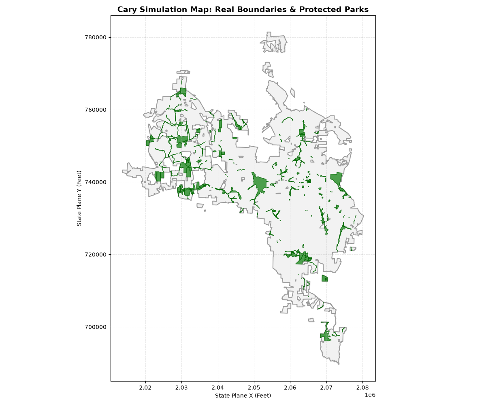

# Cary Urban Expansion Simulator (Geospatial ABM)

An advanced, data-driven Agent-Based Model (ABM) built with Python and the Mesa framework. This project simulates urban expansion and land-use conflict within the Town of Cary, North Carolina, utilizing official public domain GIS datasets streamed directly from municipal REST APIs.

## 🚀 Core Features & Architecture

### 1. Live GIS Ingestion Pipeline (`GeoPandas`)
* Bypasses static files by streaming live spatial vectors directly from the **Town of Cary Open Data Portal API**.
* Ingests the municipal corporate boundary (`cary-corporate-limits`) and filters over 800+ local environmental assets from the `parks-and-recreation-feature-polygons` dataset.
* Translates standard coordinate systems into **EPSG:2264 (NAD83 North Carolina State Plane)** to process geometric distances and acreage metrics in real-world linear feet.

### 2. Heterogeneous Agent Polymorphism
The model rejects simple random movement in favor of specialized AI developer archetypes with competing look-ahead heuristic utility functions:
* **Corporate Developers (`CorporateDeveloperAgent`):** Driven by infrastructure proximity and urban aggregation. They receive scoring bonuses when clustering builds near transit corridors and existing developments.
* **Suburban Developers (`SuburbanDeveloperAgent`):** Programmed to hunt for low-density single-family expansion, actively penalizing congested areas and prioritizing pristine forestry tracts.
* **Regulatory Compliance:** Both agent profiles share an inherited legal framework that strictly forbids encroachment into protected public park polygons.

### 3. Real-Time Analytical Dashboard
* Integrates Mesa's native `DataCollector` engine to capture multi-variable snapshots at every execution turn.
* Generates a side-by-side analytical plot mapping spatial agent distributions directly next to a historical time-series line graph tracking the inverse relationship between housing development and resource depletion.

---

## 📊 Sample Visualizations

### Multi-Layer Basemap (Real GIS Elements)
Below is the visualization of the pipeline successfully downloading, projecting, and clipping real municipal boundaries with protected green spaces:



### Simulation Micro-Grid Output
The initial simulation run using a macro-grid environment, tracking the clear divergence between corporate clustering and sprawling single-family neighborhood footprints:


---

## 🛠️ Project Structure & Setup

### Prerequisites
Ensure you have the required spatial and simulation libraries installed:
```bash
pip install mesa geopandas pandas matplotlib numpy shapely
